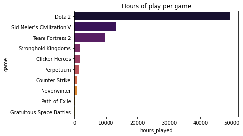
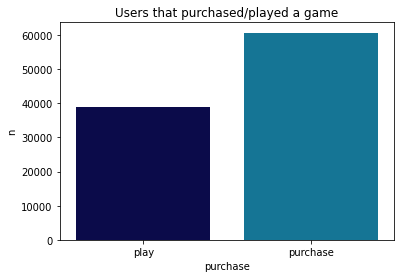

# Steam recommendation system

Steam is the largest video game hosting platform in the market with a large caleloge full of games. With access to such a variety of games, sometimes users may feel overwelmed, or feel unsure with where to start, there for it is absolutely vital that both customers new and old are provided with recommendended suitable games that align with their specific preferences. 

Therefore for this project i decided to create a recommendation system for steam games to help users find suitable game recommendations that they would be interested in. My goal for this project is to provide more accurate predictions regarding providing a user with accurate recommendations, through using a combination of steam's api, steamspy's api and kaggle data sets as well..

Links:
* [isabel.susan.joseph@gmail.com]()

### Executive Summary

For this project the aim is to improve steam's current recommendation system to provide users with much more accurate recommendations.

To solve this problem, i will be creating a content and collaborative based recommendation model that provides video game recommendations to steam users. This project will utlize Steam's API, SteamSpy's API along with data sets sourced from kaggle in order to create a recommendation system.

I took data for this project from Steam's api, Steamspy and two kaggle data sets.
* [https://www.kaggle.com/tamber/steam-video-games]()
* [https://www.kaggle.com/nikdavis/steam-store-games]()
* [https://steamcommunity.com/dev]()
* [https://steamspy.com/]()

Following that i ran multiple models for each of the collaborative and content based models. With my collaborative model i used a memory based model that used KNNBasic, KNNBaseline and as well as KNNWithMeans. In addition to that i also developed a model based collaborative filtering model using SVD's. According to the results obtained, it was found out that the KNNBaseline with pearson similarity (USER BASED) model had preformed the best out of all of the other models ran. 

With my content based model i utlized TFIDF, helps identify which item is similar to each other, and  recommend a user similar items that the user has previously liked.

Then end with one sentence that picks what your best model was and how it performed.

Lastly, you say in one or two sentences why this matters. 
For example, now as opposed to before this data analysis, you can now predict X better than Y. 

### More Information

Here I would especially suggest diving a bit deeper into your methodology and including images that you are proud of from the project.

data_cleaning.ipynb
Business understanding
Data preparation
Data cleaning

content_based.ipynb
Data understanding
Modelling (content based model)
Evaluation (content based model)

collaborative_based.ipynb
Modelling (collaborative based model)
Evaluation (collaborative based model)
Comparision between models
Deployment

### Data Visualizations

